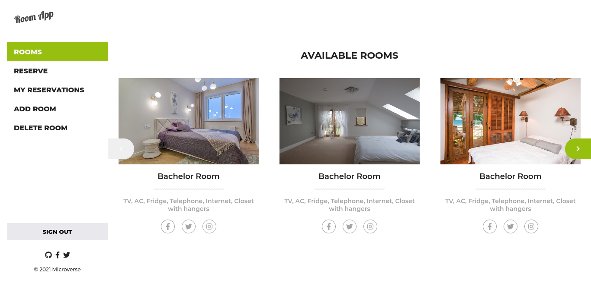

# Final group capstone - Room reservation Frontend


> Frontend client of the Room booking app



## Project

- [Kanban board](https://github.com/usmansbk/rooms-backend/projects/1)

- [GitHub](https://github.com/usmansbk/rooms-frontend/tree/main)

- Final number of team members: 4


## Backend

[API Documentation](https://polar-island-18380.herokuapp.com/)

[GitHub Repo](https://github.com/usmansbk/rooms-backend)

## Built With

- React
- Redux
- React Router

## Getting Started

To get a local copy up and running follow these simple example steps.

### Prerequisites

- NodeJS - [v16.x](https://nodejs.org/en/)
- Yarn - [1.22.15](https://yarnpkg.com/)

### Setup

```bash
git clone https://github.com/usmansbk/rooms-frontend.git
cd ./rooms-frontend
```

### Install

```bash
yarn
```

### Usage

```bash
yarn start
```

## Authors

👤 **Usman**

- GitHub: [@usmansbk](https://github.com/usmansbk)
- LinkedIn: [Usman Suleiman Babakolo](https://linkedin.com/in/usmansbk)

👤 **Simon**

- GitHub: [@SimonGrchevski](https://github.com/SimonGrchevski)
- LinkedIn: [Simon Grchevski](https://www.linkedin.com/in/simon-grchevski-682935209/)

👤 **Olawale**

- GitHub: [@olawale-o](https://github.com/olawale-o)
- LinkedIn: [Omoogun Olawale](https://linkedin.com/in/olawaleomoogun)

👤 **Denis**

- GitHub: [@denisdiaconu](https://github.com/denisdiaconu)
- LinkedIn: [Denis Andrei Diaconu](https://www.linkedin.com/in/denis-diaconu-1394091b7/)

## 🤝 Contributing

Contributions, issues, and feature requests are welcome!

Feel free to check the [issues page](../../issues/).

## Show your support

Give a ⭐️ if you like this project!

## Acknowledgments

- Microverse
- Original design by [Murat Korkmaz](https://www.behance.net/muratk) on Behance

## 📝 License

This project is [MIT](./LICENSE.md) licensed.
